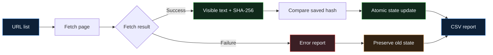

<div align="center">

# 🔎 Website Change Monitor Lite

**A lightweight Python CLI that detects visible-text changes on public web pages without losing the last known good state.**

[](https://www.python.org/)
[](https://requests.readthedocs.io/)
[](https://www.crummy.com/software/BeautifulSoup/)
[](#testing)
[](#project-status)

[Overview](#overview) · [Workflow](#workflow) · [Usage](#usage) · [Report](#csv-report) · [Reliability](#reliability)

</div>

---

## Overview

Website Change Monitor Lite reads a list of public URLs, extracts their visible text, normalizes whitespace, generates a SHA-256 fingerprint, and compares it with the last successful observation.

The project is intentionally small, but it demonstrates a complete monitoring workflow: CLI input, HTTP handling, HTML cleanup, deterministic hashing, persistent state, failure-safe updates, CSV reporting, and automated regression tests.

## Workflow



## Highlights

| Capability | Implementation |
|---|---|
| **Visible-text monitoring** | Removes `script`, `style`, and `noscript` content before hashing |
| **Stable comparison** | Collapses repeated whitespace and generates SHA-256 hashes |
| **Five clear outcomes** | `new`, `unchanged`, `changed`, `http_error`, `request_error` |
| **Failure-safe state** | Failed requests never replace the last successful hash |
| **Atomic persistence** | Writes a temporary JSON file before replacing the saved state |
| **Structured reporting** | Exports status, hashes, timestamps, and errors to CSV |
| **Configurable CLI** | Input, report, and state paths are command-line arguments |
| **Regression coverage** | Five pytest tests cover the most important reliability paths |

---

## Monitoring Outcomes

<table>
<tr>
<td align="center" width="20%">

### 🆕
**new**

First successful check

</td>
<td align="center" width="20%">

### ✅
**unchanged**

Hash still matches

</td>
<td align="center" width="20%">

### 🔄
**changed**

New hash detected

</td>
<td align="center" width="20%">

### 🌐
**http_error**

HTTP 4xx / 5xx

</td>
<td align="center" width="20%">

### ⚠️
**request_error**

Connection failure

</td>
</tr>
</table>

Only successful fetches update the stored hash. Both error outcomes preserve the previous state.

---

## Tech Stack

| Area | Technology | Purpose |
|---|---|---|
| Language | Python 3.10+ | CLI orchestration and monitoring logic |
| HTTP | Requests | Page fetching, timeouts, and status validation |
| HTML parsing | Beautiful Soup 4 | Visible-text extraction |
| Fingerprinting | `hashlib.sha256` | Deterministic content comparison |
| State | JSON + `pathlib` | Persistent atomic state storage |
| Reporting | `csv.DictWriter` | Structured run reports |
| CLI | `argparse` | Scriptable input and output configuration |
| Testing | pytest + monkeypatch | Unit and regression testing |

---

## Usage

### 1. Install

```bash
git clone https://github.com/Mr-sanabi/website-change-monitor-lite.git
cd website-change-monitor-lite

python -m venv .venv
```

Activate the environment:

```powershell
# Windows PowerShell
.\.venv\Scripts\Activate.ps1
```

```bash
# macOS / Linux
source .venv/bin/activate
```

Install runtime dependencies:

```bash
python -m pip install -r requirements.txt
```

### 2. Prepare URLs

Create a plain-text file with one public URL per line:

```text
https://example.com
https://books.toscrape.com/
```

Empty lines are ignored.

### 3. Run

```bash
python -m src.main data/urls.txt data/report.csv
```

Use a custom state path:

```bash
python -m src.main data/urls.txt data/report.csv --state-file data/custom_state.json
```

Missing output directories are created automatically.

### CLI arguments

| Argument | Required | Default | Purpose |
|---|---:|---|---|
| `input_file` | Yes | — | Text file containing one URL per line |
| `output_file` | Yes | — | Destination path for the CSV report |
| `--state-file` | No | `data/state.json` | JSON file containing the latest good hashes |

---

## CSV Report

| Column | Description |
|---|---|
| `url` | URL that was checked |
| `status_code` | HTTP status when available |
| `changed` | Monitoring outcome or failure type |
| `previous_hash` | Last successfully stored hash |
| `current_hash` | Hash from the current successful fetch |
| `checked_at` | Local ISO 8601 timestamp, precise to seconds |
| `error` | Error details for failed requests |

Example:

```csv
url,status_code,changed,previous_hash,current_hash,checked_at,error
https://example.com,200,unchanged,d003f90b...,d003f90b...,2026-07-13T13:06:26,
https://example.com/missing,404,http_error,,,2026-07-13T13:06:27,404 Client Error
```

<details>
<summary><strong>View result behavior</strong></summary>

<br>

| Value | Meaning | State updated? |
|---|---|---:|
| `new` | No previous successful hash exists | Yes |
| `unchanged` | Current and previous hashes match | Yes |
| `changed` | Current and previous hashes differ | Yes |
| `http_error` | Server returned an HTTP error | No |
| `request_error` | No valid HTTP response was received | No |

</details>

---

## Reliability

| Risk | Behaviour |
|---|---|
| Slow or stalled request | Uses a 10-second timeout |
| HTTP 4xx / 5xx | Classified as `http_error` and written to the report |
| DNS, connection, or request failure | Classified as `request_error` |
| Failed fetch | Skips parsing and hashing |
| Existing good hash during failure | Preserved without modification |
| Interrupted state write | Main state survives because replacement happens only after the temporary write succeeds |
| Missing parent directory | Created automatically for state and report paths |
| Empty report dataset | No empty CSV is written |

The state file contains only the latest successful hash for each URL:

```json
{
  "https://example.com": "d003f90bc10db991b76e6fb480123cfce2cbb2b2784abe687fccccfa7ecacad8"
}
```

---

## Testing

Install development dependencies:

```bash
python -m pip install -r requirements-dev.txt
```

Run the complete suite:

```bash
python -m pytest -v
```

```text
5 passed ✔
```

The tests cover:

- visible-text extraction and whitespace normalization
- stable SHA-256 generation
- atomic state round trips and temporary-file cleanup
- HTTP error classification with a mocked response
- preservation of an existing hash after a request failure

---

<details>
<summary><strong>Project structure</strong></summary>

<br>

```text
website-change-monitor-lite/
├── src/
│   ├── fetcher.py
│   ├── main.py
│   ├── monitor.py
│   └── storage.py
├── tests/
│   ├── test_fetcher.py
│   ├── test_main.py
│   ├── test_monitor.py
│   └── test_storage.py
├── data/
│   └── .gitkeep
├── .gitignore
├── README.md
├── requirements.txt
└── requirements-dev.txt
```

</details>

## Limitations

- Monitors normalized visible text, not visual layout
- Does not produce a line-by-line content diff
- Does not schedule runs or send notifications
- Does not support authenticated pages
- Does not bypass captchas, paywalls, or anti-bot protections
- Dynamic client-rendered content may require a browser-based implementation

## Project Status

**Portfolio-ready**

The project demonstrates a complete small-scale monitoring workflow with modular fetching, deterministic text comparison, persistent state, explicit failure classification, atomic writes, CSV reporting, and regression tests.

## Compliance

This project is intended for public pages where automated access is permitted. Respect each site's terms of service, robots.txt rules, rate limits, and applicable laws.

<div align="center">

---

Made with 🐍 Python · tested with 🧪 pytest

</div>
